# 🖥️ CompTIA A+ Comprehensive Hands-on Practice Portfolio

A complete, structured archive of my practical labs, operating system configuration, and network troubleshooting workflows aligned with the CompTIA A+ core objectives.

---

## 🌐 1. Network Diagnostics & Command-Line Utilities
*Hands-on application of networking commands to troubleshoot connectivity issues, verify local IP addressing, and check active ports.*

### Verifying IP and Testing Configurations
* **Detailed IP Configuration:** Checking network adapters, MAC addresses, and DHCP/DNS server assignments.
  
* **Releasing & Renewing Leases:** Simulating DHCP troubleshooting by clearing and requesting fresh IP addresses.
  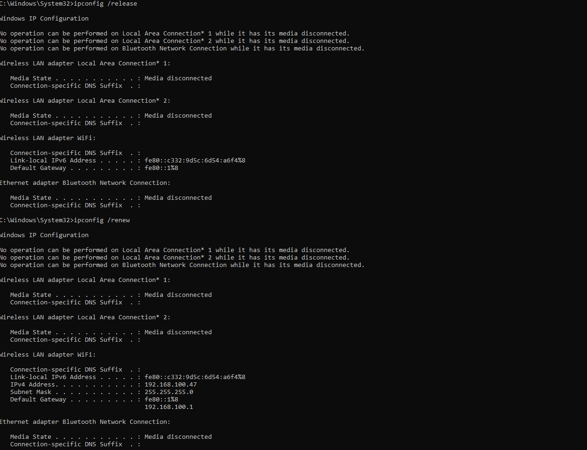
* **Flushing DNS Cache:** Resolving local name resolution issues by clearing the resolver cache.
  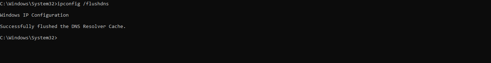

### Connectivity and Active Port Tracking
* **Network Paths & Ping Diagnostics:** Testing end-to-end latency and verifying host reachability.
  
  
* **Checking Active Connections:** Monitoring open network ports and routing tables via the command line.
  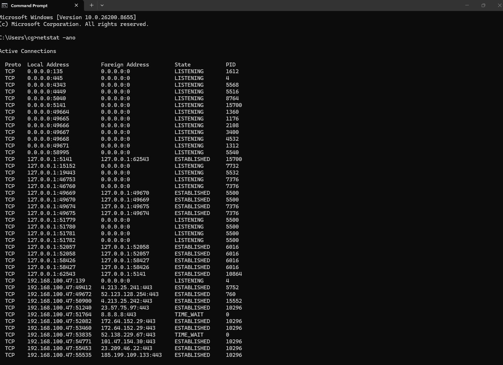

---

## 🛠️ 2. Core System Maintenance & File System Repair
*Using built-in Windows diagnostic tools to check operating system health, repair system files, and manage volumes.*

### System File Verification & Checking Access
* **System File Checker (`sfc /scannow`):** Verifying operating system file integrity to repair corrupted files.
  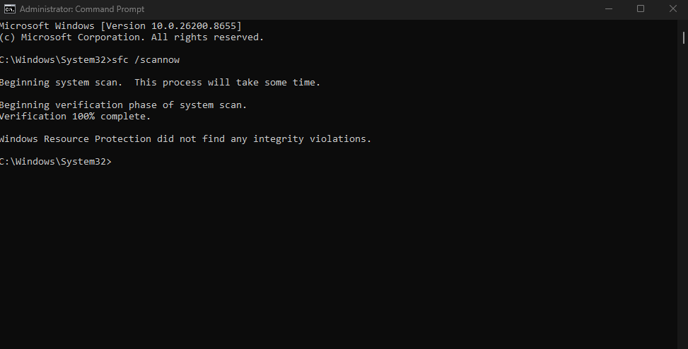
* **Access Denied / Permissions Check:** Troubleshooting command line errors and elevated privilege restrictions.
  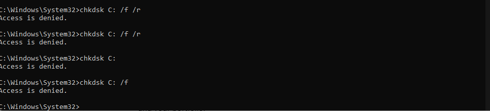

### Storage & Volume Management
* **Disk Management Console:** Partitioning storage, shrinking volumes, and assigning drive letters.
  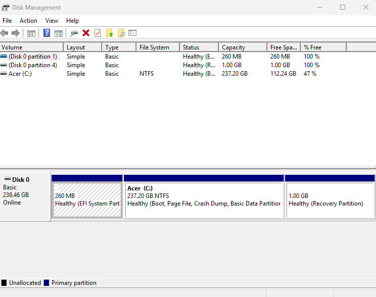
* **Diskpart Utility:** Managing drive volumes via command line tools.
  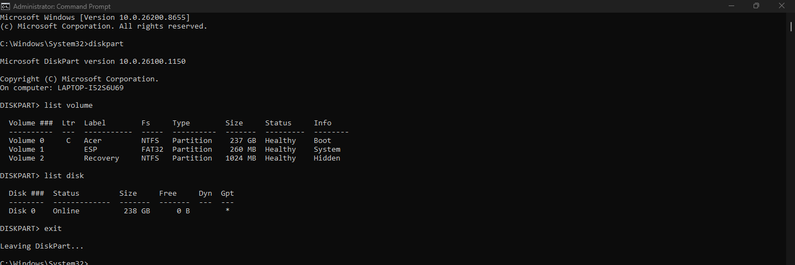
* **Drive Properties:** Verifying storage allocation and checking the NTFS file system status.
  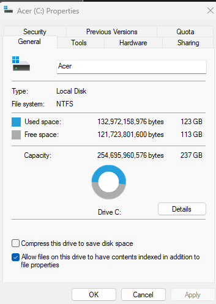
* **System Information Utility:** Reviewing hardware configurations and native environment states.
  

---

## 🔑 3. Identity, Access, & Advanced Security Management
*Configuring explicit local user profiles, verifying folder-level permissions, and system auditing.*

### User Account Administration
* **Advanced User Configuration (`netplwiz`):** Customizing user access control, group memberships, and local account permissions.
  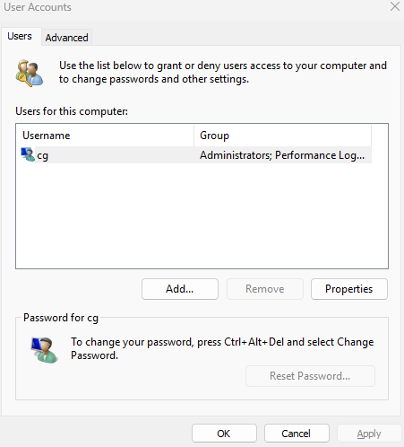
* **Advanced Profile Attributes:** Managing secure sign-in settings and properties.
  

### System Permissions & Security Policies
* **Folder Permissions & ACLs:** Reviewing inherited rights, share settings, and access control lists.
  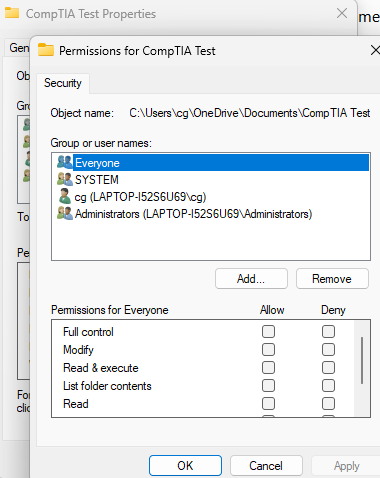
* **Windows Security & Feature Management:** Auditing active host-based firewalls and antivirus protections.
  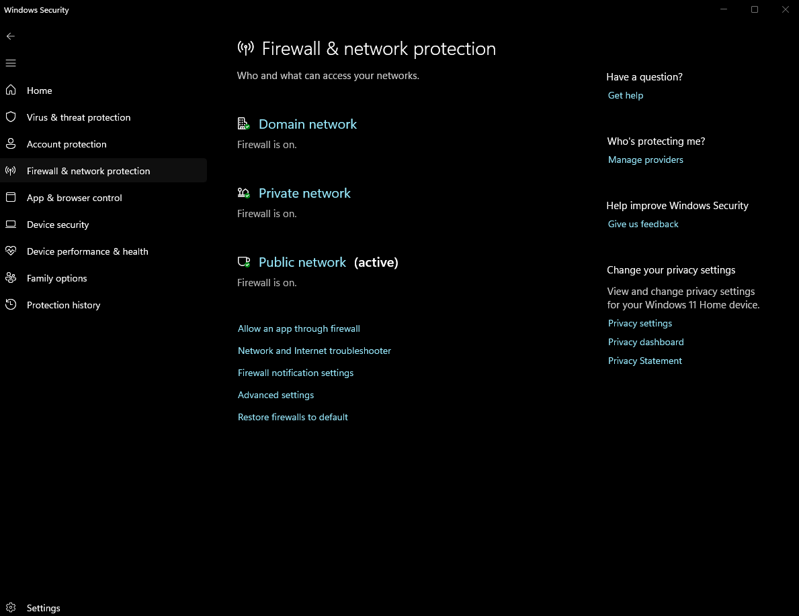
  

---

## 📊 4. Performance Monitoring & Administrative Consoles
*Tracking active resource utilization, managing startup applications, and verifying system hardware profiles.*

### Performance & Event Logs
* **Task Manager Diagnostics:** Analyzing CPU, RAM, and disk utilization graphs under load.
  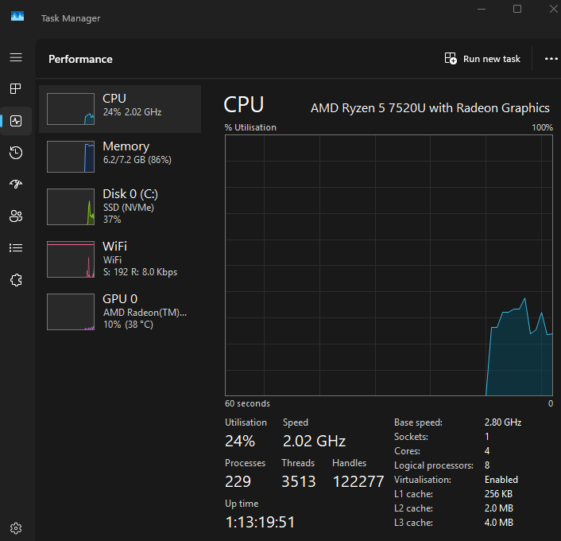
* **Resource Monitor:** Deep-diving into active processes, network usage, and memory allocation.
  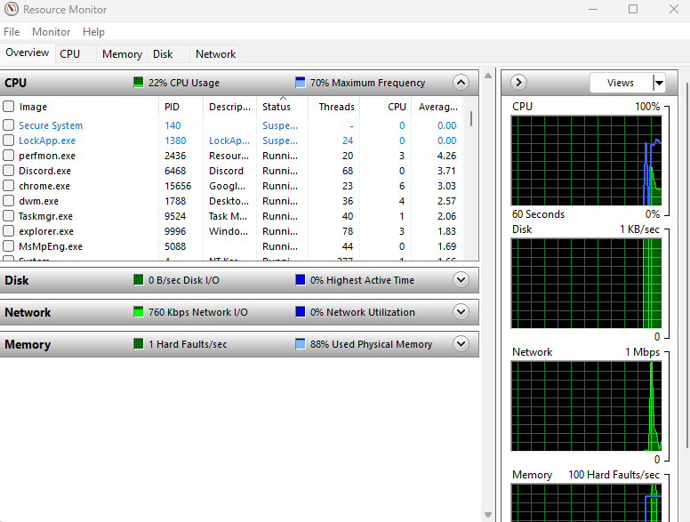
* **Event Viewer Logs:** Checking Windows System and Application logs to trace error codes and boot issues.
  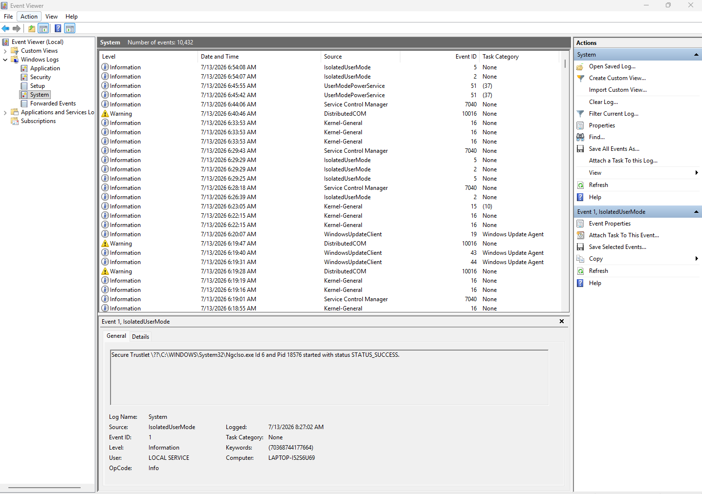

### Advanced Configuration Utilities
* **System Configuration (`msconfig`):** Adjusting boot options, service initializations, and startup programs.
  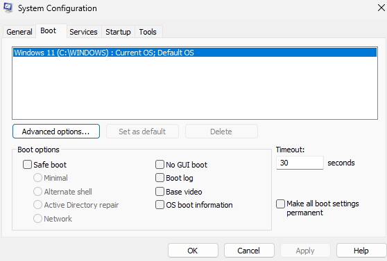
* **Device Manager:** Troubleshooting system peripheral conflicts, driver updates, and unrecognized hardware.
  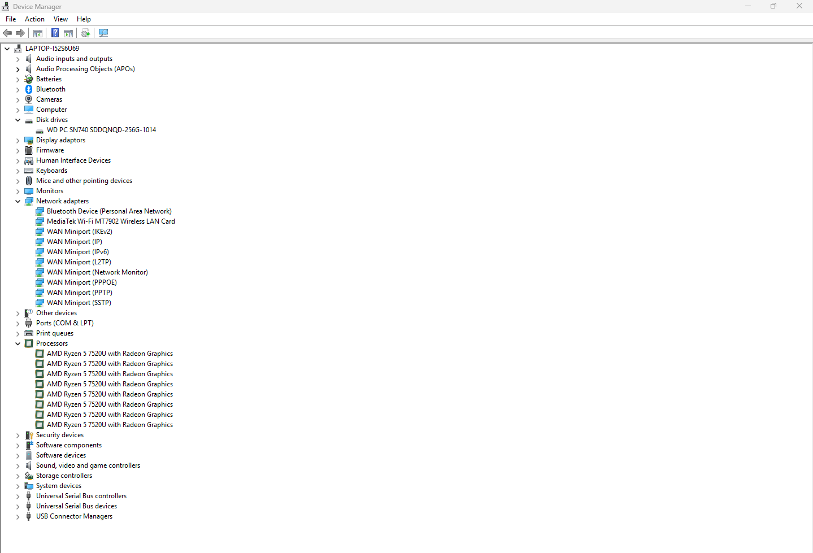
* **Registry Editor (`regedit`):** Navigating the Windows hive structure to understand system configuration data.
  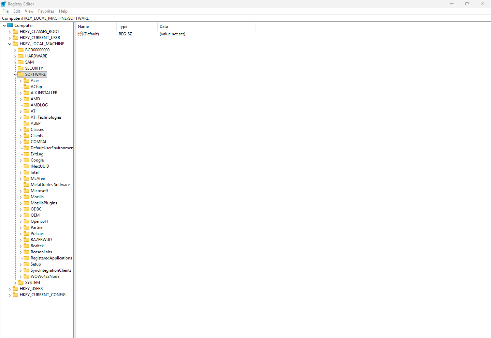
* **Power Options:** Tweaking power profiles for efficiency and performance tuning.
  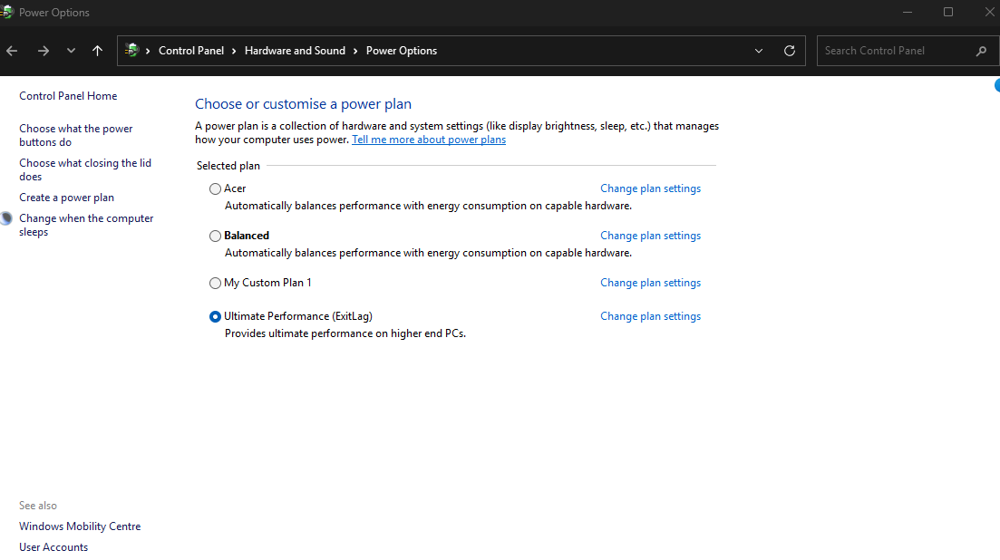
* **System Restore Configuration:** Monitoring recovery points and backup allocations.
  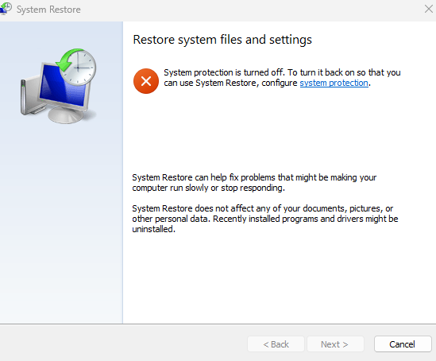

---

## 🧪 5. Advanced Environment Setups
*Exploring virtualization and multi-OS environments.*

* **Windows Subsystem for Linux (WSL):** Attempting native Linux kernel integration on a Windows host.
  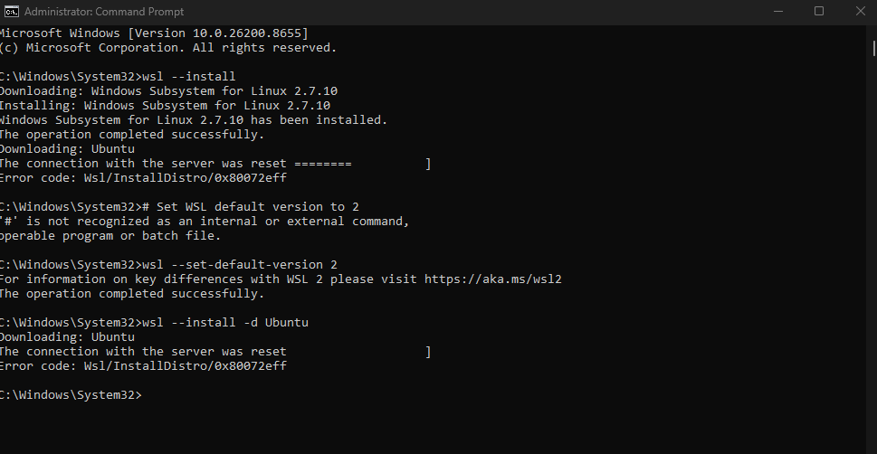
* **Windows Features Virtualization:** Enabling hypervisor components (`Hyper-V` / Virtual Machine Platform) at the OS level.
  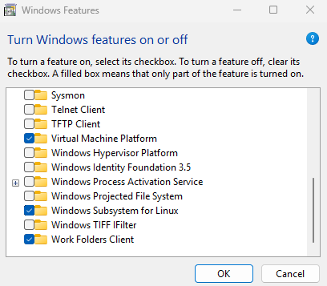
* **Windows Update Logs:** Verifying the machine is patched against recent vulnerabilities.
  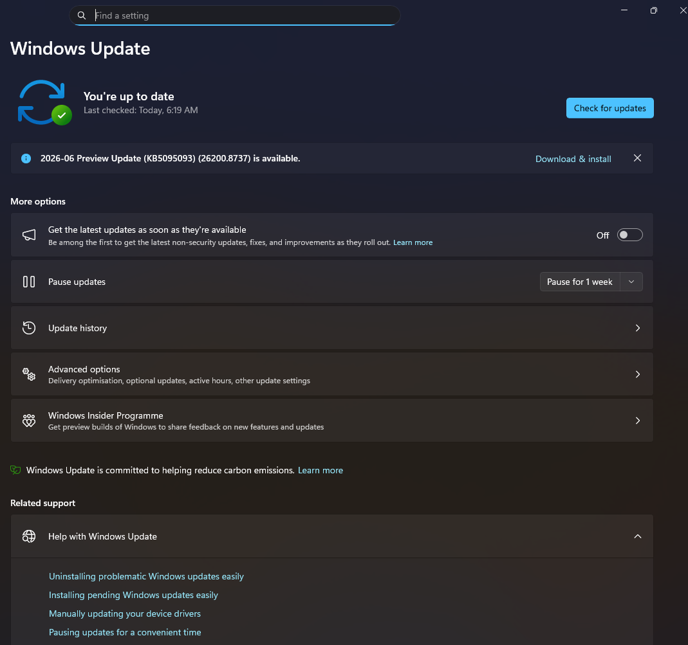
